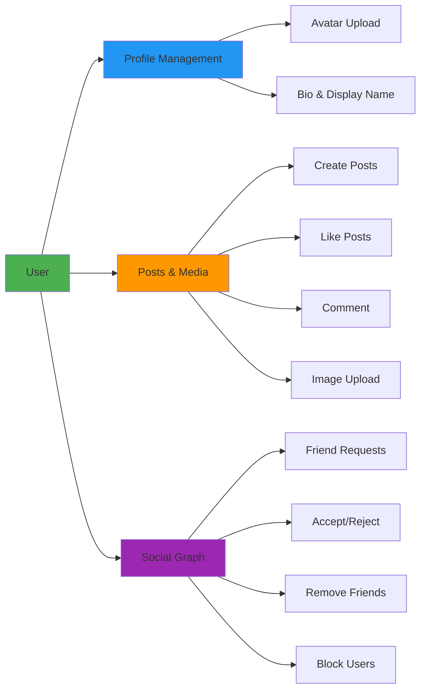
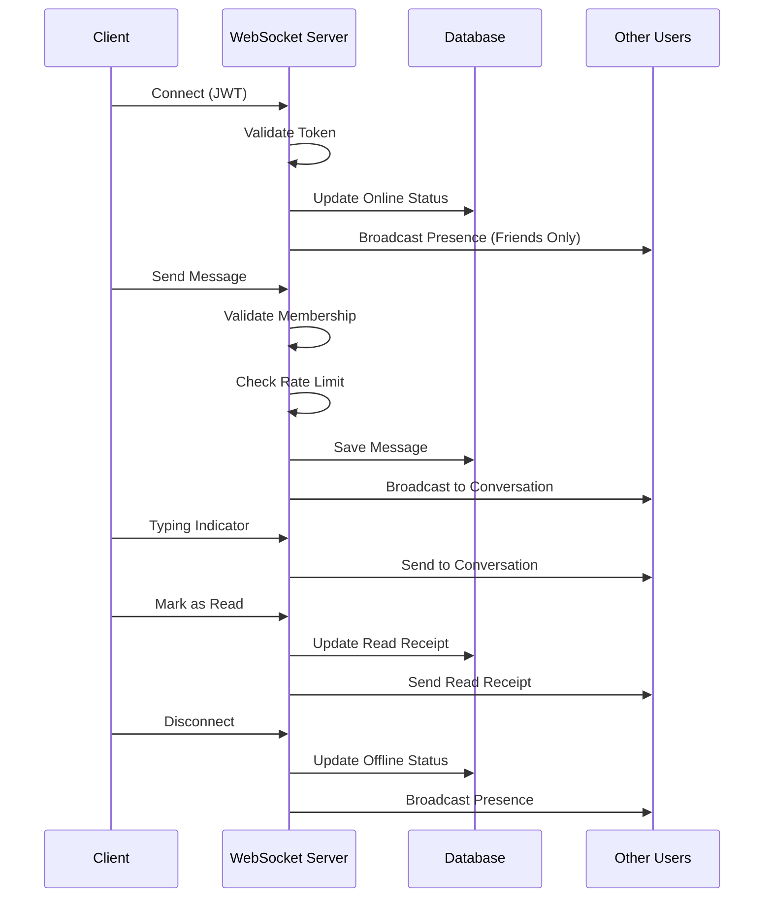
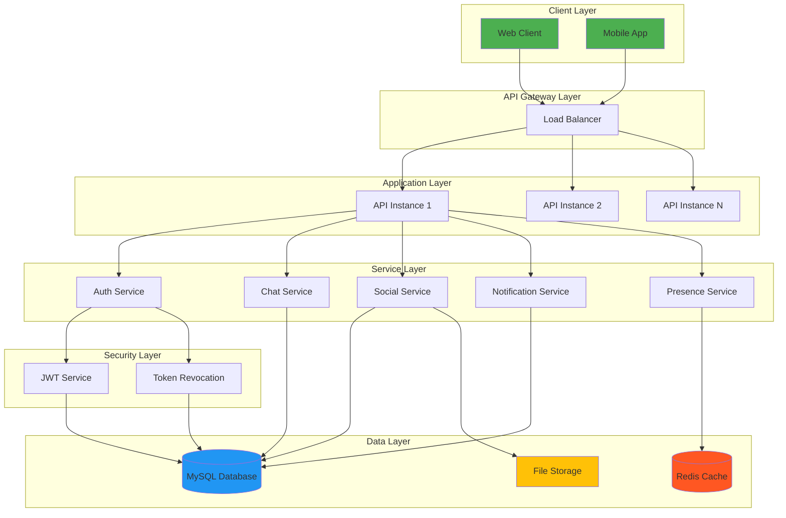
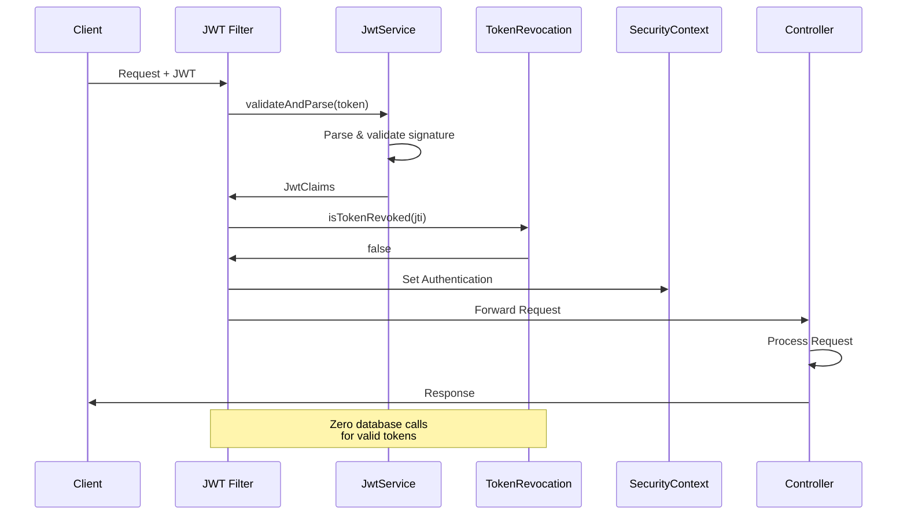
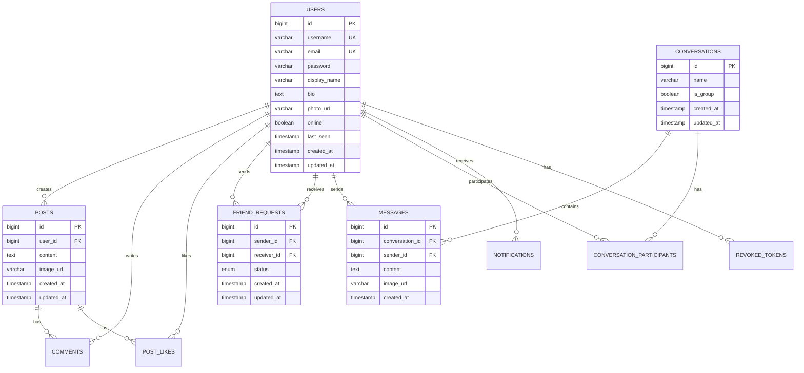
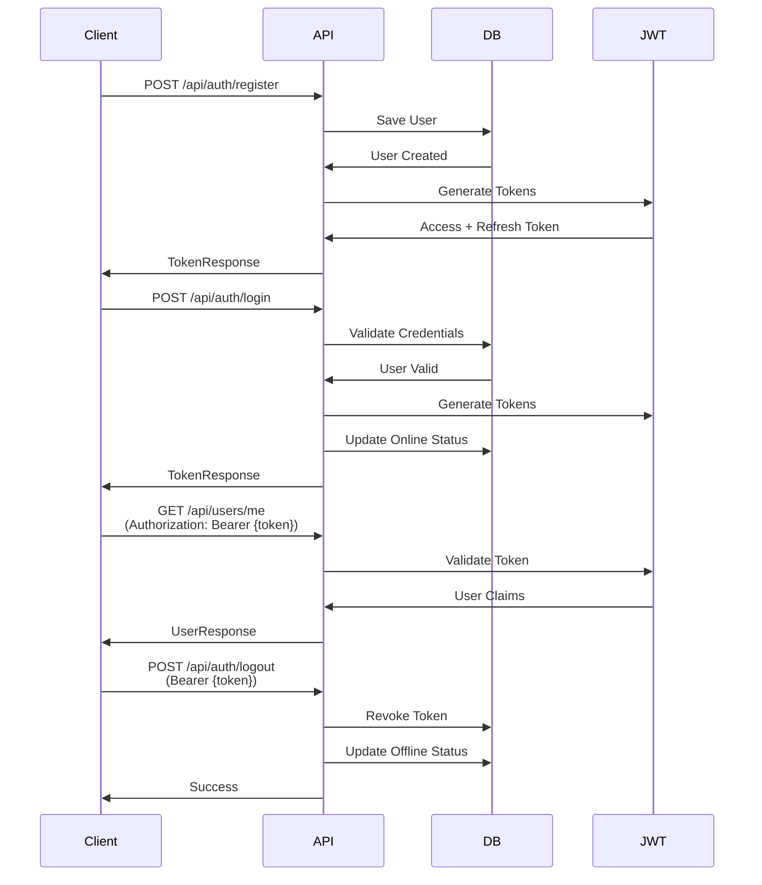
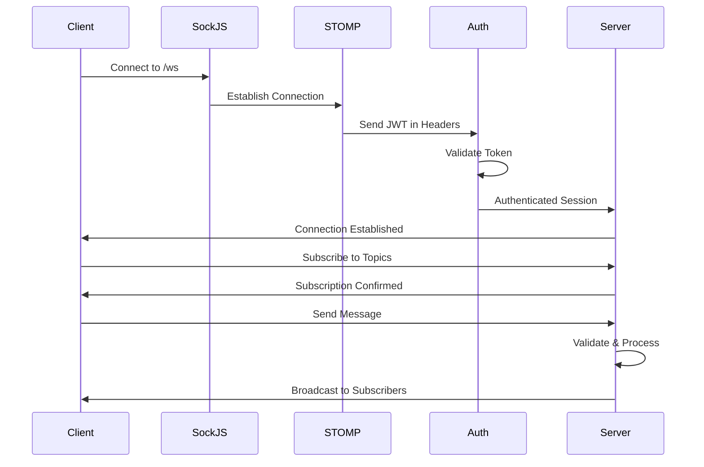
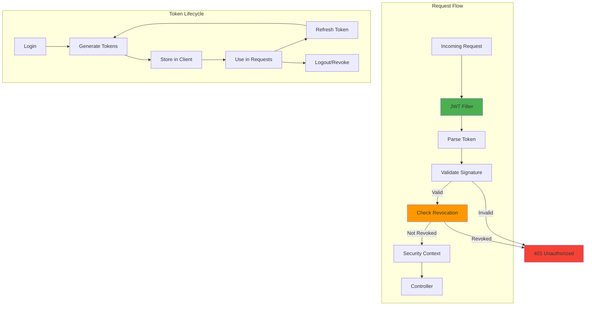
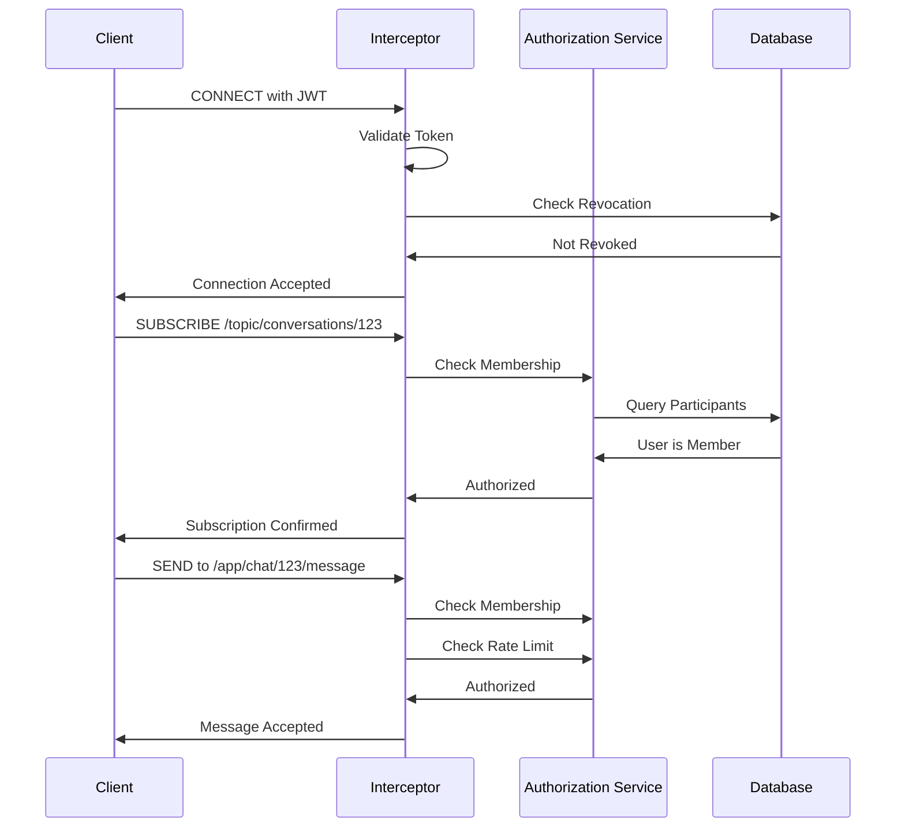

<div align="center">

# SocialChat API


**A production-ready, real-time social networking and messaging platform built with Spring Boot**

[Features](#features) • [Architecture](#architecture) • [Getting Started](#getting-started) • [API Documentation](#api-documentation) • [Deployment](#deployment)

</div>

---

## 📋 Table of Contents

- [Overview](#overview)
- [Features](#features)
- [Architecture](#architecture)
- [Tech Stack](#tech-stack)
- [Getting Started](#getting-started)
- [Configuration](#configuration)
- [API Documentation](#api-documentation)
- [WebSocket Integration](#websocket-integration)
- [Security](#security)
- [Database Schema](#database-schema)
- [Development](#development)
- [Deployment](#deployment)
- [Monitoring & Logging](#monitoring--logging)
- [Contributing](#contributing)
- [License](#license)

---

## 🎯 Overview

SocialChat API is a robust, enterprise-grade RESTful API and real-time messaging backend designed for social networking applications. Built with Spring Boot 3.x and modern Java practices, it provides a scalable foundation for building feature-rich social platforms with real-time communication capabilities.

### Key Highlights

- 🔐 **Stateless JWT Authentication** - Zero database calls per request
- 🚀 **Real-time Messaging** - WebSocket (STOMP) with SockJS fallback
- 📱 **Social Networking** - Posts, comments, likes, friend system
- 🔔 **Live Notifications** - Instant push notifications via WebSocket
- 👥 **Presence System** - Friends-only online/offline status
- 📊 **Scalable Architecture** - Production-ready with proper indexing
- 🛡️ **Enterprise Security** - Token revocation, rate limiting, input validation

---

## ✨ Features

### Social Features



- **User Management**
  - Registration and authentication (JWT-based)
  - Profile customization (avatar, bio, display name)
  - Account deletion
  - Password management

- **Content Creation**
  - Rich text posts with image support
  - Like/unlike functionality
  - Nested comments with timestamps
  - User-specific content feeds

- **Friend System**
  - Send/accept/reject friend requests
  - Friend list management
  - User blocking/unblocking
  - Relationship status tracking

- **Discovery**
  - User search by username or display name
  - Paginated results
  - Feed generation

### Real-Time Features



- **Instant Messaging**
  - One-on-one and group conversations
  - Message persistence
  - Conversation management
  - Image sharing in messages

- **Real-Time Indicators**
  - Typing indicators
  - Read receipts with timestamps
  - Message delivery confirmation

- **Presence System**
  - Online/offline status tracking
  - Friends-only visibility
  - Last seen timestamps
  - Privacy-focused design

- **Push Notifications**
  - Friend request notifications
  - Like and comment alerts
  - Message notifications
  - Real-time delivery via WebSocket

---

## 🏗️ Architecture

### System Architecture



### Security Flow



### Database ER Diagram



---

## 🛠️ Tech Stack

### Backend Framework
- **Java 17+** - Modern LTS version with enhanced features
- **Spring Boot 3.3.4** - Enterprise application framework
- **Spring Security 6** - Stateless JWT authentication
- **Spring WebSocket** - STOMP over SockJS for real-time features
- **Spring Data JPA** - Database abstraction layer

### Database & Storage
- **MySQL 8.0+** - Primary relational database
- **Flyway** - Database version control and migrations
- **HikariCP** - High-performance JDBC connection pooling

### Security & Authentication
- **JJWT 0.12.5** - JWT creation and validation
- **BCrypt** - Password hashing
- **Token Revocation System** - Logout and security invalidation

### Data Mapping & Validation
- **MapStruct 1.5.5** - Compile-time DTO mapping
- **Hibernate Validator** - Bean validation
- **Lombok** - Boilerplate code reduction

### API Documentation
- **Springdoc OpenAPI 2.5.0** - Interactive API documentation
- **Swagger UI** - API testing interface

### Development Tools
- **Maven 3.9+** - Dependency management and build
- **Spring Boot DevTools** - Hot reload during development
- **SLF4J + Logback** - Logging framework

---

## 🚀 Getting Started

### Prerequisites

Ensure you have the following installed:

- **Java Development Kit (JDK) 17 or higher**
  ```bash
  java -version
  ```

- **Maven 3.9+**
  ```bash
  mvn -version
  ```

- **MySQL 8.0+**
  ```bash
  mysql --version
  ```

### Installation

1. **Clone the repository**
   ```bash
   git clone https://github.com/Yahia995/social-chat-api.git
   cd socialchat-api/social-chat-api
   ```

2. **Create the database**
   ```bash
   mysql -u root -p
   ```
   ```sql
   CREATE DATABASE social_chat_db CHARACTER SET utf8mb4 COLLATE utf8mb4_unicode_ci;
   CREATE USER 'socialchat'@'localhost' IDENTIFIED BY 'your_secure_password';
   GRANT ALL PRIVILEGES ON social_chat_db.* TO 'socialchat'@'localhost';
   FLUSH PRIVILEGES;
   EXIT;
   ```

3. **Configure application properties**
   
   Edit `src/main/resources/application.properties`:
   ```properties
   spring.datasource.url=jdbc:mysql://localhost:3306/social_chat_db
   spring.datasource.username=socialchat
   spring.datasource.password=your_secure_password
   
   app.jwt.secret=your-256-bit-base64-encoded-secret-key-here
   app.upload.dir=./uploads
   ```

4. **Generate JWT Secret**
   ```bash
   # Generate a secure 256-bit key
   openssl rand -base64 32
   ```

5. **Build the application**
   ```bash
   mvn clean install
   ```

6. **Run the application**
   ```bash
   # Development mode
   mvn spring-boot:run -Dspring-boot.run.profiles=dev
   
   # Or run the JAR
   java -jar target/socialchat-api-1.0.0.jar --spring.profiles.active=dev
   ```

7. **Verify the installation**
   
   Open your browser and navigate to:
   - API Health: http://localhost:8080/health
   - Swagger UI: http://localhost:8080/swagger-ui.html
   - API Docs: http://localhost:8080/api-docs

### Quick Test

```bash
# Register a new user
curl -X POST http://localhost:8080/api/auth/register \
  -H "Content-Type: application/json" \
  -d '{
    "username": "testuser",
    "email": "test@example.com",
    "password": "password123",
    "displayName": "Test User"
  }'

# Login
curl -X POST http://localhost:8080/api/auth/login \
  -H "Content-Type: application/json" \
  -d '{
    "usernameOrEmail": "testuser",
    "password": "password123"
  }'
```

---

## ⚙️ Configuration

### Environment Variables

| Variable | Description | Default | Required |
|----------|-------------|---------|----------|
| `DB_URL` | MySQL JDBC connection URL | `jdbc:mysql://localhost:3306/social_chat_db` | ✅ |
| `DB_USERNAME` | Database username | `root` | ✅ |
| `DB_PASSWORD` | Database password | `root` | ✅ |
| `JWT_SECRET` | Base64-encoded secret key (256+ bits) | - | ✅ |
| `JWT_ACCESS_EXPIRATION` | Access token TTL in milliseconds | `36000000` (10h) | ❌ |
| `JWT_REFRESH_EXPIRATION` | Refresh token TTL in milliseconds | `604800000` (7d) | ❌ |
| `UPLOAD_DIR` | File upload directory path | `./uploads` | ❌ |
| `CORS_ALLOWED_ORIGINS` | Allowed CORS origins (production) | `*` | ❌ |
| `SPRING_PROFILES_ACTIVE` | Active Spring profile | `dev` | ❌ |

### Application Profiles

#### Development Profile (`dev`)

```properties
# src/main/resources/application-dev.properties
server.port=8080
server.ssl.enabled=false
spring.jpa.show-sql=true
logging.level.com.socialchat=DEBUG
logging.level.org.springframework.security=DEBUG
```

**Activate with:**
```bash
mvn spring-boot:run -Dspring-boot.run.profiles=dev
```

#### Production Profile (`ssl`)

```properties
# src/main/resources/application-ssl.properties
server.port=8443
server.ssl.enabled=true
server.ssl.key-store=${SSL_KEYSTORE_PATH:classpath:keystore.p12}
server.ssl.key-store-password=${SSL_KEYSTORE_PASSWORD}
server.ssl.key-store-type=PKCS12
logging.level.com.socialchat=INFO
app.cors.allowed-origins=${CORS_ALLOWED_ORIGINS:https://yourdomain.com}
```

**Activate with:**
```bash
java -jar socialchat-api.jar --spring.profiles.active=ssl
```

### JWT Token Structure

```json
{
  "jti": "unique-token-id-uuid",
  "sub": "username",
  "userId": 123,
  "roles": ["ROLE_USER"],
  "type": "access",
  "iat": 1699999999,
  "exp": 1700000000
}
```

| Claim | Description | Type |
|-------|-------------|------|
| `jti` | Unique token identifier (for revocation) | String (UUID) |
| `sub` | Username | String |
| `userId` | User's database ID | Long |
| `roles` | User roles | Array[String] |
| `type` | Token type (`access` or `refresh`) | String |
| `iat` | Issued at timestamp | Unix timestamp |
| `exp` | Expiration timestamp | Unix timestamp |

---

## 📚 API Documentation

### Authentication Flow



### REST API Endpoints

#### Authentication (`/api/auth`)

| Method | Endpoint | Description | Auth Required |
|--------|----------|-------------|---------------|
| POST | `/register` | Register new user | ❌ |
| POST | `/login` | Login with credentials | ❌ |
| POST | `/refresh` | Refresh access token | ❌ |
| POST | `/logout` | Revoke tokens | ✅ |
| POST | `/change-password` | Change password | ✅ |

<details>
<summary><b>Example: Register User</b></summary>

**Request:**
```http
POST /api/auth/register HTTP/1.1
Content-Type: application/json

{
  "username": "johndoe",
  "email": "john@example.com",
  "password": "SecurePass123!",
  "displayName": "John Doe"
}
```

**Response:**
```json
{
  "success": true,
  "message": "User registered successfully",
  "data": {
    "accessToken": "eyJhbGciOiJIUzI1NiIsInR5cCI6IkpXVCJ9...",
    "refreshToken": "eyJhbGciOiJIUzI1NiIsInR5cCI6IkpXVCJ9...",
    "tokenType": "Bearer",
    "expiresIn": 36000,
    "user": {
      "id": 1,
      "username": "johndoe",
      "email": "john@example.com",
      "displayName": "John Doe",
      "photoUrl": null,
      "online": false,
      "createdAt": "2026-01-22T10:30:00"
    }
  }
}
```
</details>

#### Users (`/api/users`)

| Method | Endpoint | Description | Auth Required |
|--------|----------|-------------|---------------|
| GET | `/me` | Get current user profile | ✅ |
| GET | `/{id}` | Get user by ID | ✅ |
| GET | `/username/{username}` | Get user by username | ✅ |
| PATCH | `/me` | Update profile | ✅ |
| POST | `/me/photo` | Upload profile photo | ✅ |
| DELETE | `/me` | Delete account | ✅ |

#### Friends (`/api/friends`)

| Method | Endpoint | Description | Auth Required |
|--------|----------|-------------|---------------|
| GET | `/` | Get friends list (paginated) | ✅ |
| POST | `/request/{userId}` | Send friend request | ✅ |
| GET | `/requests/received` | Get received requests | ✅ |
| GET | `/requests/sent` | Get sent requests | ✅ |
| POST | `/requests/{id}/accept` | Accept friend request | ✅ |
| POST | `/requests/{id}/reject` | Reject friend request | ✅ |
| DELETE | `/{friendId}` | Remove friend | ✅ |
| POST | `/block/{userId}` | Block user | ✅ |
| DELETE | `/block/{userId}` | Unblock user | ✅ |
| GET | `/relationship/{userId}` | Get relationship status | ✅ |

#### Posts (`/api/posts`)

| Method | Endpoint | Description | Auth Required |
|--------|----------|-------------|---------------|
| POST | `/` | Create post (multipart) | ✅ |
| GET | `/feed` | Get posts feed | ✅ |
| GET | `/{id}` | Get post by ID | ✅ |
| GET | `/user/{userId}` | Get user's posts | ✅ |
| PATCH | `/{id}` | Update post | ✅ |
| DELETE | `/{id}` | Delete post | ✅ |
| POST | `/{id}/like` | Like post | ✅ |
| DELETE | `/{id}/like` | Unlike post | ✅ |
| POST | `/{id}/comments` | Add comment | ✅ |
| GET | `/{id}/comments` | Get comments (paginated) | ✅ |
| DELETE | `/{postId}/comments/{commentId}` | Delete comment | ✅ |

#### Chat (`/api/chat`)

| Method | Endpoint | Description | Auth Required |
|--------|----------|-------------|---------------|
| POST | `/conversations` | Create/get conversation | ✅ |
| GET | `/conversations` | Get all conversations | ✅ |
| GET | `/conversations/{id}` | Get conversation details | ✅ |
| GET | `/conversations/{id}/messages` | Get messages (paginated) | ✅ |
| POST | `/conversations/{id}/messages` | Send message (REST) | ✅ |
| POST | `/conversations/{id}/read` | Mark as read | ✅ |
| DELETE | `/conversations/{id}` | Leave conversation | ✅ |

#### Notifications (`/api/notifications`)

| Method | Endpoint | Description | Auth Required |
|--------|----------|-------------|---------------|
| GET | `/` | Get notifications (paginated) | ✅ |
| GET | `/unread-count` | Get unread count | ✅ |
| POST | `/{id}/read` | Mark as read | ✅ |
| POST | `/read-all` | Mark all as read | ✅ |
| DELETE | `/{id}` | Delete notification | ✅ |

#### Presence (`/api/presence`)

| Method | Endpoint | Description | Auth Required |
|--------|----------|-------------|---------------|
| GET | `/friends` | Get online friends IDs | ✅ |
| GET | `/user/{userId}` | Check user status (friends only) | ✅ |

#### Search (`/api/search`)

| Method | Endpoint | Description | Auth Required |
|--------|----------|-------------|---------------|
| GET | `/users?q={query}` | Search users | ✅ |

### Response Format

All API responses follow a consistent structure:

**Success Response:**
```json
{
  "success": true,
  "message": "Operation successful",
  "data": { ... }
}
```

**Error Response:**
```json
{
  "success": false,
  "error": {
    "code": "ERROR_CODE",
    "message": "Human-readable error message",
    "details": { ... }
  }
}
```

**Paginated Response:**
```json
{
  "success": true,
  "data": {
    "content": [ ... ],
    "page": 0,
    "size": 20,
    "totalElements": 150,
    "totalPages": 8,
    "first": true,
    "last": false
  }
}
```

---

## 🔌 WebSocket Integration

### Connection Setup



### Connection Endpoint

```
WebSocket Endpoint: ws://localhost:8080/ws
Protocol: STOMP over SockJS
```

### Client Connection Example

**JavaScript (SockJS + STOMP):**

```javascript
// Import libraries
import SockJS from 'sockjs-client';
import { Client } from '@stomp/stompjs';

// Initialize connection
const socket = new SockJS('http://localhost:8080/ws');
const stompClient = new Client({
  webSocketFactory: () => socket,
  connectHeaders: {
    Authorization: `Bearer ${accessToken}`
  },
  debug: (str) => console.log(str),
  reconnectDelay: 5000,
  heartbeatIncoming: 4000,
  heartbeatOutgoing: 4000,
});

// Connection callback
stompClient.onConnect = (frame) => {
  console.log('Connected:', frame);
  
  // Subscribe to topics
  subscribeToTopics();
};

// Error callback
stompClient.onStompError = (frame) => {
  console.error('Broker error:', frame.headers['message']);
  console.error('Details:', frame.body);
};

// Activate connection
stompClient.activate();
```

### Subscribe Destinations

#### Personal Queues (User-specific)

| Destination | Description | Payload Type |
|-------------|-------------|--------------|
| `/user/queue/notifications` | Personal notifications | `NotificationEvent` |
| `/user/queue/presence` | Friends' online status | `PresenceEvent` |

**Example:**
```javascript
stompClient.subscribe('/user/queue/notifications', (message) => {
  const notification = JSON.parse(message.body);
  console.log('New notification:', notification);
  // { id, type, title, message, data, createdAt }
});

stompClient.subscribe('/user/queue/presence', (message) => {
  const presence = JSON.parse(message.body);
  console.log('Friend status:', presence);
  // { userId, username, online, timestamp }
});
```

#### Conversation Topics (Multi-user)

| Destination | Description | Payload Type |
|-------------|-------------|--------------|
| `/topic/conversations/{id}/messages` | New messages | `MessageResponse` |
| `/topic/conversations/{id}/typing` | Typing indicators | `TypingEvent` |
| `/topic/conversations/{id}/read-receipts` | Read receipts | `ReadReceiptEvent` |

**Example:**
```javascript
const conversationId = 123;

// Subscribe to messages
stompClient.subscribe(`/topic/conversations/${conversationId}/messages`, (message) => {
  const msg = JSON.parse(message.body);
  console.log('New message:', msg);
  displayMessage(msg);
});

// Subscribe to typing indicators
stompClient.subscribe(`/topic/conversations/${conversationId}/typing`, (message) => {
  const typing = JSON.parse(message.body);
  if (typing.typing) {
    showTypingIndicator(typing.username);
  } else {
    hideTypingIndicator(typing.username);
  }
});

// Subscribe to read receipts
stompClient.subscribe(`/topic/conversations/${conversationId}/read-receipts`, (message) => {
  const receipt = JSON.parse(message.body);
  updateMessageReadStatus(receipt.userId, receipt.readAt);
});
```

### Send Destinations

#### Send Message

```javascript
stompClient.publish({
  destination: `/app/chat/${conversationId}/message`,
  body: JSON.stringify({
    content: "Hello, World!",
    timestamp: new Date().toISOString()
  })
});
```

#### Send Typing Indicator

```javascript
// User started typing
stompClient.publish({
  destination: `/app/chat/${conversationId}/typing`,
  body: JSON.stringify({
    typing: true,
    timestamp: new Date().toISOString()
  })
});

// User stopped typing
stompClient.publish({
  destination: `/app/chat/${conversationId}/typing`,
  body: JSON.stringify({
    typing: false,
    timestamp: new Date().toISOString()
  })
});
```

#### Mark as Read

```javascript
stompClient.publish({
  destination: `/app/chat/${conversationId}/read`,
  body: JSON.stringify({
    timestamp: new Date().toISOString()
  })
});
```

### Event Payloads

#### MessageResponse
```json
{
  "id": 1,
  "conversationId": 123,
  "sender": {
    "id": 5,
    "username": "johndoe",
    "displayName": "John Doe",
    "photoUrl": "/media/photos/avatar.jpg"
  },
  "content": "Hello, World!",
  "imageUrl": null,
  "createdAt": "2026-01-22T10:30:00"
}
```

#### TypingEvent
```json
{
  "conversationId": 123,
  "userId": 5,
  "username": "johndoe",
  "typing": true
}
```

#### ReadReceiptEvent
```json
{
  "conversationId": 123,
  "userId": 5,
  "username": "johndoe",
  "readAt": "2026-01-22T10:35:00"
}
```

#### PresenceEvent
```json
{
  "userId": 5,
  "username": "johndoe",
  "online": true,
  "timestamp": "2026-01-22T10:30:00"
}
```

#### NotificationEvent
```json
{
  "id": 1,
  "type": "FRIEND_REQUEST",
  "title": "Friend Request",
  "message": "Alice sent you a friend request",
  "data": "{\"requestId\": 42, \"senderId\": 7}",
  "createdAt": "2026-01-22T10:30:00"
}
```

### Complete React Example

```jsx
import { useEffect, useState } from 'react';
import SockJS from 'sockjs-client';
import { Client } from '@stomp/stompjs';

function ChatComponent({ conversationId, accessToken }) {
  const [stompClient, setStompClient] = useState(null);
  const [messages, setMessages] = useState([]);
  const [connected, setConnected] = useState(false);

  useEffect(() => {
    // Initialize WebSocket
    const socket = new SockJS('http://localhost:8080/ws');
    const client = new Client({
      webSocketFactory: () => socket,
      connectHeaders: {
        Authorization: `Bearer ${accessToken}`
      },
      
      onConnect: () => {
        setConnected(true);
        console.log('Connected to WebSocket');

        // Subscribe to messages
        client.subscribe(`/topic/conversations/${conversationI}/messages`, (message) => {
          const newMessage = JSON.parse(message.body);
          setMessages(prev => [...prev, newMessage]);
        });

        // Subscribe to typing indicators
        client.subscribe(`/topic/conversations/${conversationId}/typing`, (message) => {
          const typing = JSON.parse(message.body);
          handleTypingIndicator(typing);
        });
      },

      onStompError: (frame) => {
        console.error('STOMP error:', frame);
        setConnected(false);
      },

      onDisconnect: () => {
        setConnected(false);
        console.log('Disconnected from WebSocket');
      }
    });

    client.activate();
    setStompClient(client);

    return () => {
      client.deactivate();
    };
  }, [conversationId, accessToken]);

  const sendMessage = (content) => {
    if (stompClient && connected) {
      stompClient.publish({
        destination: `/app/chat/${conversationId}/message`,
        body: JSON.stringify({ content })
      });
    }
  };

  const sendTyping = (isTyping) => {
    if (stompClient && connected) {
      stompClient.publish({
        destination: `/app/chat/${conversationId}/typing`,
        body: JSON.stringify({ typing: isTyping })
      });
    }
  };

  return (
    <div>
      <div className="connection-status">
        {connected ? '🟢 Connected' : '🔴 Disconnected'}
      </div>
      {/* Your chat UI here */}
    </div>
  );
}
```

### WebSocket Testing

Test your WebSocket connection using the included HTML test page:

```bash
# Start the application
mvn spring-boot:run

# Open in browser
open http://localhost:8080/websocket-test.html
```

Or use the test HTML file at `src/main/resources/static/websocket-test.html`

---

## 🔐 Security

### Authentication Architecture



### Stateless JWT Authentication

#### Key Features

- **Zero Database Calls** - User info extracted directly from JWT claims
- **Single Token Parsing** - Parse once, use multiple times per request
- **Token Revocation Support** - Database-backed blacklist for logout
- **Role-Based Access** - Granular permission control

#### Token Generation

```java
// Access Token (10 hours)
{
  "jti": "uuid-v4",
  "sub": "username",
  "userId": 123,
  "roles": ["ROLE_USER"],
  "type": "access",
  "iat": 1699999999,
  "exp": 1700036000
}

// Refresh Token (7 days)
{
  "jti": "uuid-v4",
  "sub": "username",
  "userId": 123,
  "type": "refresh",
  "iat": 1699999999,
  "exp": 1700604799
}
```

### WebSocket Security



#### Security Features

- **Connection Authentication** - JWT validation on CONNECT
- **Subscription Authorization** - Verify conversation membership on SUBSCRIBE
- **Send Authorization** - Validate membership and rate limits on SEND
- **Rate Limiting** - 30 messages/minute per user per conversation
- **Message Validation** - Max 5000 characters
- **Presence Privacy** - Friends-only online status

### Security Best Practices

#### Password Security
- BCrypt hashing with automatic salt generation
- Minimum 6 characters (configurable via validation)
- Password change requires current password verification

#### Token Security
- HMAC-SHA256 signature algorithm
- 256-bit secret key requirement
- Automatic expiration
- Revocation support on logout/password change

#### Input Validation
```java
@NotBlank(message = "Username is required")
@Size(min = 3, max = 50)
private String username;

@Email(message = "Invalid email format")
private String email;

@Size(max = 5000, message = "Content must not exceed 5000 characters")
private String content;
```

#### CORS Configuration
```java
// Development - Allow all
configuration.setAllowedOriginPatterns(List.of("*"));

// Production - Restrict to specific domains
configuration.setAllowedOriginPatterns(List.of(
  "https://yourdomain.com",
  "https://app.yourdomain.com"
));
```

### Common Attack Mitigations

| Attack Type | Mitigation Strategy |
|-------------|---------------------|
| SQL Injection | JPA/Hibernate parameterized queries |
| XSS | Input validation, output encoding |
| CSRF | Stateless JWT (no cookies) |
| Brute Force | Rate limiting (30 req/min WebSocket) |
| Token Theft | Short expiration, HTTPS only in prod |
| Session Fixation | Stateless authentication |

---

## 🗄️ Database Schema

### Optimized Indexing Strategy

```sql
-- Performance-critical indexes
CREATE INDEX idx_users_username ON users(username);
CREATE INDEX idx_users_online ON users(online);

CREATE INDEX idx_friend_requests_status_users 
  ON friend_requests(status, sender_id, receiver_id);

CREATE INDEX idx_messages_conversation_created 
  ON messages(conversation_id, created_at);

CREATE INDEX idx_notifications_user_read 
  ON notifications(user_id, is_read);

CREATE INDEX idx_participants_user_conversation 
  ON conversation_participants(user_id, conversation_id);
```

### Key Relationships

```
Users (1) ─────< (N) Posts
Users (1) ─────< (N) Comments
Users (1) ─────< (N) Post_Likes
Users (1) ─────< (N) Friend_Requests (Sender)
Users (1) ─────< (N) Friend_Requests (Receiver)
Users (1) ─────< (N) Messages (Sender)
Users (1) ─────< (N) Conversation_Participants
Users (1) ─────< (N) Notifications
Users (1) ─────< (N) Revoked_Tokens

Posts (1) ─────< (N) Comments
Posts (1) ─────< (N) Post_Likes

Conversations (1) ─────< (N) Messages
Conversations (1) ─────< (N) Conversation_Participants
```

### Migration Management

Flyway manages all database schema changes:

```
src/main/resources/db/migration/
├── V1__initial_schema.sql
├── V2__add_indexes.sql (future)
└── V3__add_features.sql (future)
```

**Create a new migration:**
```bash
# Create new migration file
touch src/main/resources/db/migration/V2__description.sql

# Flyway will auto-apply on next startup
mvn spring-boot:run
```

---

## 💻 Development

### Project Structure

```
socialchat-api/
├── src/
│   ├── main/
│   │   ├── java/com/socialchat/
│   │   │   ├── config/              # Application configuration
│   │   │   │   ├── SecurityConfig.java
│   │   │   │   ├── WebSocketConfig.java
│   │   │   │   ├── OpenApiConfig.java
│   │   │   │   └── FileStorageConfig.java
│   │   │   ├── controller/          # REST controllers
│   │   │   │   ├── AuthController.java
│   │   │   │   ├── UserController.java
│   │   │   │   ├── FriendController.java
│   │   │   │   ├── PostController.java
│   │   │   │   ├── ChatController.java
│   │   │   │   └── NotificationController.java
│   │   │   ├── dto/                 # Data Transfer Objects
│   │   │   │   ├── auth/
│   │   │   │   ├── user/
│   │   │   │   ├── friend/
│   │   │   │   ├── post/
│   │   │   │   ├── chat/
│   │   │   │   ├── notification/
│   │   │   │   └── common/
│   │   │   ├── entity/              # JPA entities
│   │   │   │   ├── User.java
│   │   │   │   ├── Post.java
│   │   │   │   ├── Comment.java
│   │   │   │   ├── Conversation.java
│   │   │   │   ├── Message.java
│   │   │   │   └── ...
│   │   │   ├── exception/           # Custom exceptions
│   │   │   │   ├── ApiException.java
│   │   │   │   ├── ResourceNotFoundException.java
│   │   │   │   └── GlobalExceptionHandler.java
│   │   │   ├── mapper/              # MapStruct mappers
│   │   │   │   ├── UserMapper.java
│   │   │   │   ├── PostMapper.java
│   │   │   │   └── ChatMapper.java
│   │   │   ├── repository/          # Spring Data repositories
│   │   │   │   ├── UserRepository.java
│   │   │   │   ├── PostRepository.java
│   │   │   │   └── MessageRepository.java
│   │   │   ├── security/            # Security components
│   │   │   │   ├── JwtService.java
│   │   │   │   ├── JwtClaims.java
│   │   │   │   ├── JwtAuthenticationFilter.java
│   │   │   │   └── SecurityUtils.java
│   │   │   ├── service/             # Business logic
│   │   │   │   ├── AuthService.java
│   │   │   │   ├── UserService.java
│   │   │   │   ├── ChatService.java
│   │   │   │   ├── WebSocketService.java
│   │   │   │   └── PresenceService.java
│   │   │   └── websocket/           # WebSocket handlers
│   │   │       ├── ChatWebSocketHandler.java
│   │   │       └── WebSocketAuthInterceptor.java
│   │   └── resources/
│   │       ├── application.properties
│   │       ├── application-dev.properties
│   │       ├── application-ssl.properties
│   │       ├── db/migration/
│   │       │   └── V1__initial_schema.sql
│   │       └── static/
│   │           └── websocket-test.html
│   └── test/                        # Test classes
├── pom.xml
└── README.md
```

### Code Style Guidelines

#### Naming Conventions
- **Classes**: PascalCase (`UserService`, `AuthController`)
- **Methods**: camelCase (`getUserById`, `sendMessage`)
- **Variables**: camelCase (`userId`, `accessToken`)
- **Constants**: UPPER_SNAKE_CASE (`MAX_FILE_SIZE`, `BEARER_PREFIX`)

#### Annotations
```java
@Slf4j              // Lombok logging
@Service            // Spring service
@RequiredArgsConstructor  // Constructor injection
@Transactional      // Database transactions
@Valid              // Bean validation
```

### Building for Production

```bash
# Clean and build
mvn clean package -DskipTests

# Build with tests
mvn clean install

# Generate JAR in target/
ls -lh target/socialchat-api-1.0.0.jar
```

### Running Tests

```bash
# Run all tests
mvn test

# Run specific test class
mvn test -Dtest=UserServiceTest

# Run with coverage
mvn clean test jacoco:report
```

---

## 🚢 Deployment

### Docker Deployment

**Dockerfile:**
```dockerfile
FROM eclipse-temurin:17-jre-alpine
WORKDIR /app
COPY target/socialchat-api-1.0.0.jar app.jar
EXPOSE 8080
ENTRYPOINT ["java", "-jar", "app.jar"]
```

**docker-compose.yml:**
```yaml
version: '3.8'

services:
  mysql:
    image: mysql:8.0
    environment:
      MYSQL_ROOT_PASSWORD: rootpass
      MYSQL_DATABASE: social_chat_db
      MYSQL_USER: socialchat
      MYSQL_PASSWORD: securepass
    ports:
      - "3306:3306"
    volumes:
      - mysql_data:/var/lib/mysql

  api:
    build: .
    ports:
      - "8080:8080"
    environment:
      DB_URL: jdbc:mysql://mysql:3306/social_chat_db
      DB_USERNAME: socialchat
      DB_PASSWORD: securepass
      JWT_SECRET: your-base64-encoded-secret
    depends_on:
      - mysql

volumes:
  mysql_data:
```

**Deploy:**
```bash
# Build and run
docker-compose up -d

# View logs
docker-compose logs -f api

# Stop
docker-compose down
```

### Production Checklist

- [ ] Set strong `JWT_SECRET` (256-bit base64)
- [ ] Configure SSL/TLS certificates
- [ ] Set `CORS_ALLOWED_ORIGINS` to specific domains
- [ ] Use production database with backups
- [ ] Enable HTTPS only (`--spring.profiles.active=ssl`)
- [ ] Configure proper logging levels (INFO/WARN)
- [ ] Set up reverse proxy (nginx/Apache)
- [ ] Configure file upload limits
- [ ] Set up monitoring (Prometheus/Grafana)
- [ ] Implement rate limiting at proxy level
- [ ] Regular security updates
- [ ] Database connection pooling tuning

### Environment Variables (Production)

```bash
export DB_URL="jdbc:mysql://prod-db:3306/social_chat_db?useSSL=true"
export DB_USERNAME="socialchat_prod"
export DB_PASSWORD="$(cat /run/secrets/db_password)"
export JWT_SECRET="$(cat /run/secrets/jwt_secret)"
export SSL_KEYSTORE_PATH="/etc/ssl/socialchat.p12"
export SSL_KEYSTORE_PASSWORD="$(cat /run/secrets/keystore_password)"
export CORS_ALLOWED_ORIGINS="https://socialchat.com,https://app.socialchat.com"
export UPLOAD_DIR="/var/socialchat/uploads"

java -jar socialchat-api.jar --spring.profiles.active=ssl
```

---

## 📊 Monitoring & Logging

### Logging Configuration

```properties
# Production logging
logging.level.root=WARN
logging.level.com.socialchat=INFO
logging.level.org.springframework.security=WARN
logging.pattern.console=%d{yyyy-MM-dd HH:mm:ss} - %msg%n
```

### Health Check

```bash
curl http://localhost:8080/health
```

**Response:**
```json
{
  "status": "UP",
  "timestamp": "2026-01-22T10:30:00Z"
}
```

### Key Metrics to Monitor

- **Performance**
  - API response times
  - Database query performance
  - WebSocket connection count
  - Message throughput

- **Security**
  - Failed login attempts
  - Token revocation rate
  - Unusual access patterns

- **Business**
  - Active users
  - Messages per day
  - Friend connections
  - Post engagement

### Integration with Monitoring Tools

#### Prometheus
```yaml
# prometheus.yml
scrape_configs:
  - job_name: 'socialchat-api'
    metrics_path: '/actuator/prometheus'
    static_configs:
      - targets: ['localhost:8080']
```

#### Logging Aggregation
```bash
# Ship logs to ELK stack
docker run -d \
  -v /var/log/socialchat:/logs \
  logstash:latest
```

---

## 🤝 Contributing

We welcome contributions! Please follow these guidelines:

### How to Contribute

1. **Fork the repository**
2. **Create a feature branch**
   ```bash
   git checkout -b feature/amazing-feature
   ```
3. **Commit your changes**
   ```bash
   git commit -m 'Add amazing feature'
   ```
4. **Push to branch**
   ```bash
   git push origin feature/amazing-feature
   ```
5. **Open a Pull Request**

### Code Guidelines

- Follow existing code style
- Write unit tests for new features
- Update documentation
- Add JavaDoc comments for public APIs
- Ensure all tests pass before submitting PR

### Reporting Issues

When reporting issues, please include:
- Operating system and Java version
- Steps to reproduce
- Expected vs actual behavior
- Relevant logs or error messages

---

## 📄 License

This project is licensed under the **MIT License** - see the [LICENSE](LICENSE) file for details.

---

## 📞 Support

- **Documentation**: [API Docs](http://localhost:8080/swagger-ui.html)
- **Issues**: [GitHub Issues](https://github.com/Yahia995/social-chat-api/issues)
- **Email**: support@socialchat.com

---

## 🙏 Acknowledgments

- Spring Boot team for the excellent framework
- Open source community

---

<div align="center">

**Built with ❤️ using Spring Boot**

⭐ Star us on GitHub if you find this project useful!

[⬆ Back to Top](#socialchat-api)

</div>
